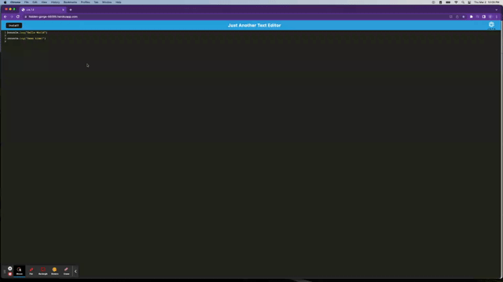
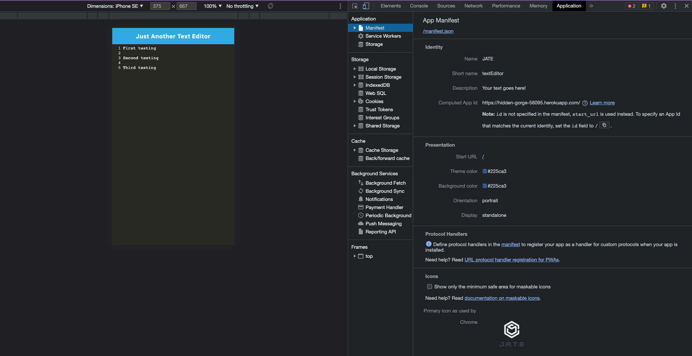

# JATE (Just A Text Editor)

## Technology Used

| Technology Used         | Resource URL           | 
| ------------- |:-------------:| 
| HTML | [https://developer.mozilla.org/en-US/docs/Web/HTML](https://developer.mozilla.org/en-US/docs/Web/HTML)     |   
| CSS | [https://developer.mozilla.org/en-US/docs/Web/CSS](https://developer.mozilla.org/en-US/docs/Web/CSS)     |     
| Git | [https://git-scm.com/](https://git-scm.com/)     |   
| JavaScript   | [https://developer.mozilla.org/en-US/docs/Learn/JavaScript](https://developer.mozilla.org/en-US/docs/Learn/JavaScript)      |
| Express.js  | [https://expressjs.com/](https://expressjs.com/)     |
| Node.js   |  [https://nodejs.org/en/](https://nodejs.org/en/)    |
| idb | [https://www.npmjs.com/package/idb](https://www.npmjs.com/package/idb)     |   
| webpack | [https://webpack.js.org/](https://webpack.js.org/)     |   
| workbox | [https://developer.chrome.com/docs/workbox/the-ways-of-workbox/](https://developer.chrome.com/docs/workbox/the-ways-of-workbox/)     |   


## Description

JATE is a text editor app designed to work both online and offline with various data saving options to ensure that your data is not lost in any situation. It has implemented techniques to fetch and save data to an IndexedDB database, utilizing the idb package as a simple wrapper around the IndexedDB API. When used offline, the application can be downloaded as a desktop app. JATE includes useful methods for storing and retrieving data, and is trusted by major companies such as Google and Mozilla.

[Link to the deployed app](https://hidden-gorge-56095.herokuapp.com/)

GIF demonstrates the application functionality:




## Table of Contents

- [Code Example](#code-example)
- [Installation](#installation)
- [Usage](#usage)
- [Features](#features)
- [Learning Points](#learning-points)
- [Author Info](#author-info)
- [Credits](#credits)
- [License](#license)


## Code Example

These lines of code demonstrate how to configure webpack, bundle CSS and image assets, use webpack loader to add Babel to ensure compatibility with older browsers and generate an index.html file and separate CSS file using webpack plugins.
```js
module.exports = () => {
  return {
    mode: 'development',
    entry: {
      main: './src/js/index.js',
      install: './src/js/install.js'
    },
    output: {
      filename: '[name].bundle.js',
      path: path.resolve(__dirname, 'dist'),
    },
    plugins: [
      new HtmlWebpackPlugin({
        template: './index.html',
        title: 'JATE'
      }),

      new InjectManifest({
        swSrc: './src-sw.js',
        swDest: 'src-sw.js',
      }),

      new WebpackPwaManifest({
        fingerprints: false,
        inject: true,
        name: 'JATE',
        short_name: 'textEditor',
        description: 'Your text goes here!',
        background_color: '#225ca3',
        theme_color: '#225ca3',
        start_url: '/',
        publicPath: '/',
        icons: [
          {
            src: path.resolve('src/images/logo.png'),
            sizes: [96, 128, 192, 256, 384, 512],
            destination: path.join('assets', 'icons'),
          },
        ],
      }),
    ],

    module: {
      rules: [
        {
          test: /\.css$/i,
          use: ['style-loader', 'css-loader'],
        },
        {
          test: /\.m?js$/,
          exclude: /node_modules/,
          use: {
            loader: 'babel-loader',
            options: {
              presets: ['@babel/preset-env'],
              plugins: ['@babel/plugin-proposal-object-rest-spread', '@babel/transform-runtime'],
            },
          },
        },
      ],
    },
  };
};

```

## Installation

- Open Heroku deployed application : https://hidden-gorge-56095.herokuapp.com/
- Go to the link and hit the "install" button to install the app locally.

For repo clone or download:

- Download or clone repository to use this application on local machine.
- Node.js is required to run the application

To install necessary dependencies, run the following command :
- `npm i`
- Run `npm run start:dev` and `npm run start` in terminal to start.
- Then go to http://localhost:3001/ to run this application on your local machine.

## Usage

- Use heroku deployed application : https://hidden-gorge-56095.herokuapp.com/ and install to use it offline.

## Features

The following image shows the application's manifest.json file




The following image shows the application's registered service worker:


The following image shows the application's IndexedDB storage:


## Learning Points

- Explain the role of entry points and output properties in webpack bundling.
- Configure webpack using webpack.config.js file.
- Bundle CSS and image assets
- Use webpack loader to add Babel to ensure compatibility with older browsers.
- Generate an index.html file and separate CSS file using webpack plugins.
- Incorporate Hot Module Reloading to a webpack app to improve the development experience.
- Identify the client-server model.
- Leverage caching strategies to optimize performance.
- Execute a full-stack application with a server and client-side development server.
- Implement IndexedDB inside a JavaScript application.
- Implement CREATE, READ, UPDATE, and DELETE commands for an IndexedDB instance.
- Convert an existing application into a Progressive Web Application (PWA).


## Author Info 

```md
### Gladys Ange Isingizwe 

* [Email](gladyisingizwe@gmail.com)
* [LindeIn](www.linkedin.com/in/gladys-isingizwe)
* [Github]()https://github.com/Isglad
```

## Credits

Thanks to the instructional staff at UC Berkeley Coding Bootcamp:
- Jerome Chenette
- Manuel Nunes
- James Harding

## License

Please refer to the LICENSE in the repo.
